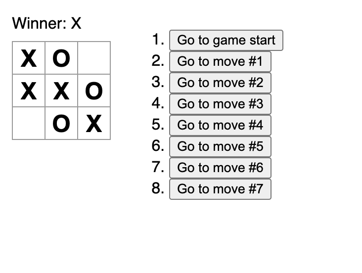

# Tic Tac Toe

This is a simple Tic Tac Toe game built with React. The game features two players, represented by O's and X's, and the first player to achieve 3 consecutive O's or X's in a line wins. The game keeps track of a history of moves made and allows for the player to go back to a previous step.

